# google-maps-at-88-mph

The folks maintaining [Google Maps](https://www.google.com/maps) regularly update the satellite imagery it serves its users, but **outdated versions of the imagery are kept around for a year or two**. This Python-based tool automatically crawls its way through these versions, figuring out which provide unique imagery and downloading it for a user-defined *(that's you! you get to define things!)* area, eventually **assembling it in the form of a GIF**.

*This weekend project is based on [ærialbot](https://github.com/doersino/aerialbot), a previous weekend project of mine.*

Scroll down to learn how to set it up on your machine, or stay up here for some examples.

There's usually two or three different views of any given area available in the "version history", which can yield neat 3D effects (the `` attributes contain the invocations used to generate them):

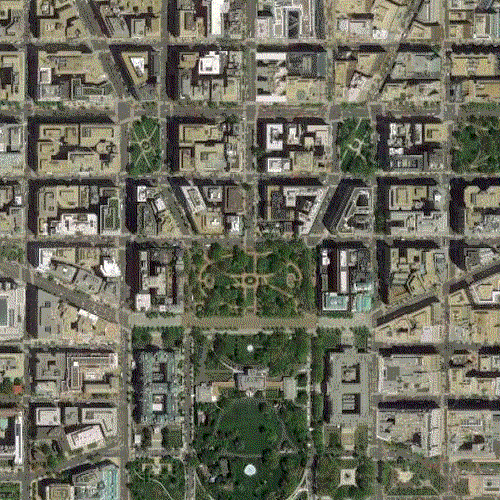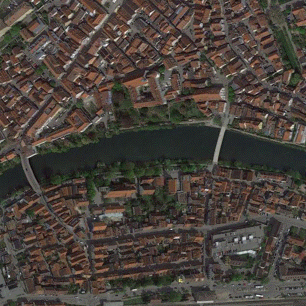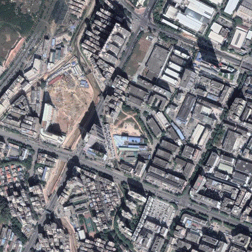

For areas of the world that have changed significantly recently, flipping through the imagery versions is almost like a timelapse – consider the port of Beirut before and after the [2020 explosion](https://en.wikipedia.org/wiki/2020_Beirut_explosion) on the left, or the perpetually-over-budget-and-behind-schedule construction of the new [Stuttgart central station](https://en.wikipedia.org/wiki/Stuttgart_Hauptbahnhof) on the right.

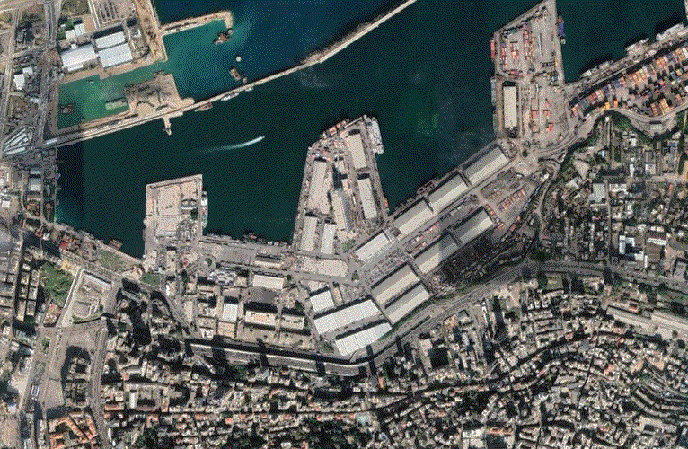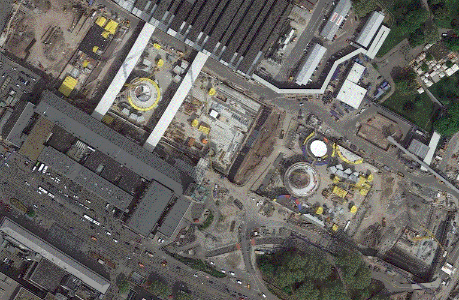

It's also fun to look at airports and [center pivot irrigation fields](https://www.youtube.com/playlist?list=PLTphPoE54a1s_ZdCkGwbhQO9O5SMSitA1) through the lens this tool provides:

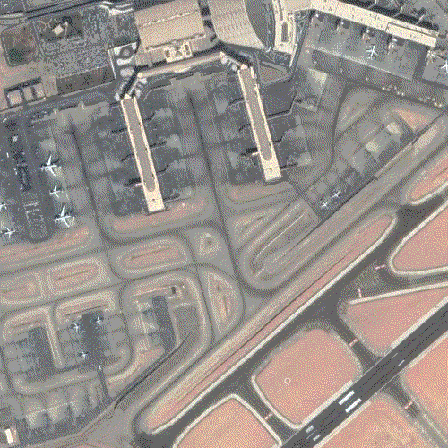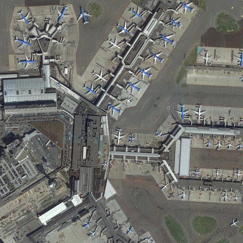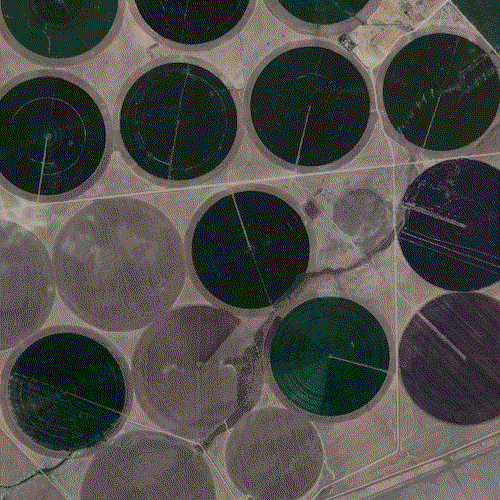

As an alternative to the usual straight-down imagery, which is great for navigating but obscures the verticality of buildings and structures, Google Maps also provides *oblique* views shot at a 45-degree angle – from all of the four cardinal directions – for many urban areas. This kind of imagery looks great wherever skyscrapers are around – say, in New York City:

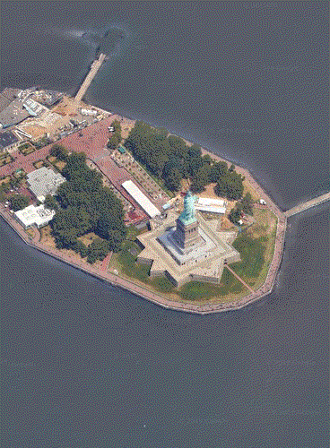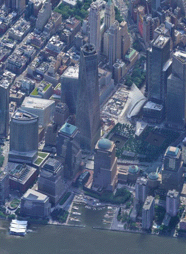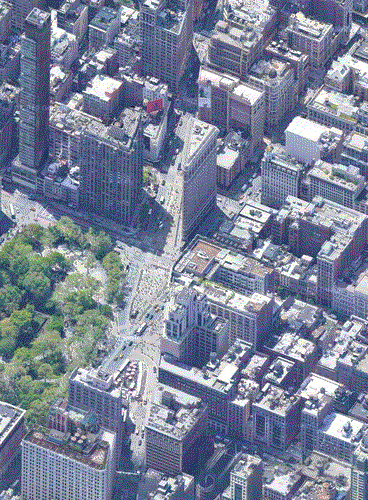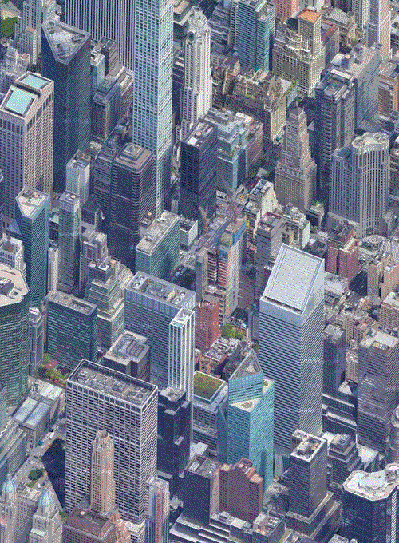

Because Google regularly removes the oldest available versions, all of this is rather ephemeral – a year from now (which, at the time of writing, was July 2021), the invocations of this tool that have created the GIFs above may yield totally different results. Longer-term timelapses of the surface of our planet can be found on [Google Earth Timelapse](https://earthengine.google.com/timelapse/) *(or through [@earthacrosstime](https://twitter.com/earthacrosstime), another weekend project of mine, namely a Twitter bot that posts randomly selected timelapses off it)*, but what's available there doesn't reach the high resolution of Google Maps (and isn't available for 45-degree views).


## Setup

Being a good [Python 3](https://www.python.org) citizen, this tool integrates with `venv` to avoid dependency hell. (Although it only requires the `Pillow` and `requests` packages.) Run the following commands to get it installed on your system:

```bash
$ git clone https://github.com/doersino/google-maps-at-88-mph
$ python3 -m venv google-maps-at-88-mph
$ cd google-maps-at-88-mph
$ source bin/activate
$ pip3 install -r requirements.txt
```

(To deactivate the virtual environment, run `deactivate`.)


## Usage

Once you've set everything up, run the following command:

```bash
$ python3 googlemapsat88mph.py --help
```

That'll wax poetic about the available command-line flags and arguments. Importantly, there are three positional arguments, *i.e.*, you've got to set these:

1. The latitude-longitude pair you're interested in, along with
2. how wide (east-west extent) and...
3. ...how tall (north-south extent, both in meters) the downloaded area should be.

Along with those three, you need to supply a value for at least one of the `-m`, `-w`, and `-h` flags – the `--help` output explains them in detail.

For example, the following invocation will create the first of the GIFs embedded above, showing the White House:

```bash
$ python3 googlemapsat88mph.py 38.900068,-77.036555 1000 1000 -w 500
```

That's basically it! For your viewing pleasure, here's a video of the CLI in action *(slightly outdated; the `-d` flag for 45-degree imagery has been added since)*, first scrolling through the `--help` output, then executing the command from above:

https://user-images.githubusercontent.com/1944410/126881010-a007e632-2229-440b-a0fe-768f5ce22d14.mp4


## FAQ

### Why the name?

Because [when this baby hits 88 miles per hour, you're gonna see some serious shit](https://en.wikipedia.org/wiki/Back_to_the_Future).

### Why did you make this tool?

I became aware of how Google Maps versions its imagery as a side-effect of building and maintaining [ærialbot](https://github.com/doersino/aerialbot). Figuring out a way to explore past imagery seemed super interesting – note that initially, I wasn't sure how far back the available imagery would go. Finding out that it's only about a year was a bit of a letdown, but there's still some gems to be found either way. The ephemerality aspect also appeals to me.

### Does this violate Google's terms of use?

Probably. I haven't checked. But they haven't banned my IP for downloading tens of thousands of map tiles during development and testing (of [ærialbot](https://github.com/doersino/aerialbot) *and* this), so you're probably good as long as you don't use this tool for downloading a centimeter-scale map of your country. What's more, I can't think of a way in which this tool competes with or keeps revenue from any of Google's products. (And it's always worth keeping in mind that Google is an incredibly profitable company that earns the bulk of its income via folks like you just going about their days surfing the ad-filled web.)

### Something is broken – can you fix it?

Possibly. Please feel free to [file an issue](https://github.com/doersino/google-maps-at-88-mph/issues) – I'll be sure to take a look!

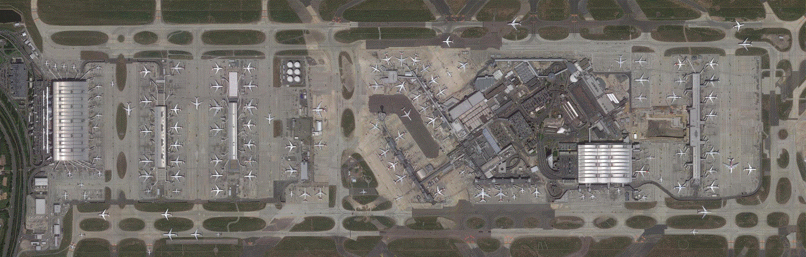
